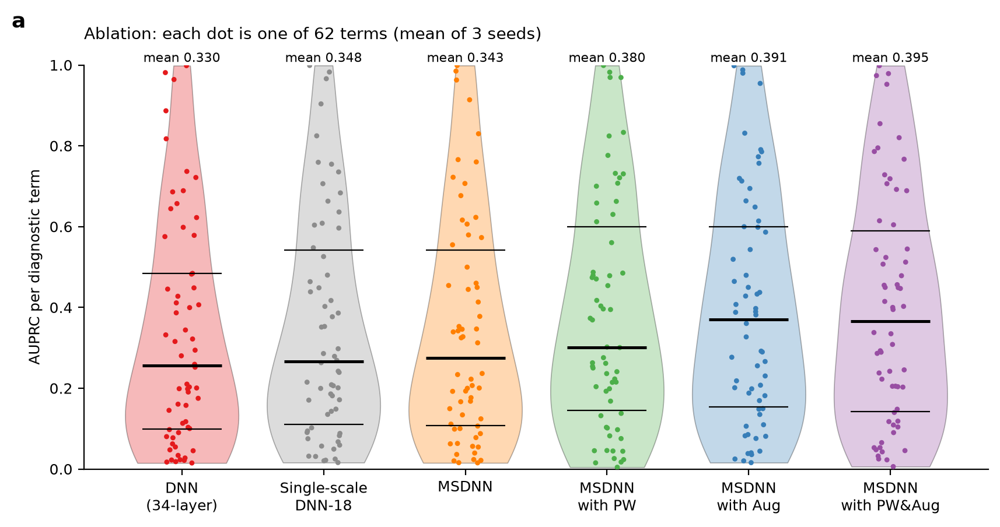

# Self-supervised learning for 12-lead ECG diagnosis: a reproduction of Lai et al. (2023)

A reproduction, on public data, of

> Lai J., Tan H., Wang J. *et al.* **Practical intelligent diagnostic algorithm for wearable 12-lead ECG via
> self-supervised learning on large-scale dataset.** *Nat. Commun.* 14, 3741 (2023).
> https://doi.org/10.1038/s41467-023-39472-8

The paper's method is re-implemented from its Methods section and every experiment in its figures and tables is
re-run: the MSDNN network, MoCo pre-training with a distributional divergence loss, four ECG augmentations, and a
weighted BCE + pairwise-ranking loss. The paper's 658,486 wearable ECGs are proprietary (Cardiocloud), and its
GitHub repository no longer exists, so public datasets stand in for them (see *Deviations*).

## Key results

The paper's main findings hold on public data. Absolute scores are lower because the data differ (see *Deviations*).

| Claim (paper) | Paper | This reproduction |
|---|---|---|
| Multiscale MSDNN matches the 34-layer DNN with far fewer parameters | AUPRC 0.582 vs 0.578 | 0.343 vs 0.330 (2.17M vs 11.2M params) |
| Self-supervised pre-training helps | +1.1 AUPRC points | +3.7 points (p < 0.001) |
| ECG augmentation helps | +5.5 points | +4.9 points (p < 0.001) |
| 1 lead < 3 leads < 12 leads | 0.464 < 0.586 < 0.646 | 0.298 < 0.373 < 0.395 |
| CPSC2018 F1 | 0.839 | 0.820 (held-out split) |

Full tables: [results/RESULTS.md](results/RESULTS.md); figures: [figures/](figures/); side-by-side comparison with the paper: [COMPARISON.md](COMPARISON.md).



## Figures

| File | Paper | Shows |
|---|---|---|
| [fig1_ecg_augmentations](figures/fig1_ecg_augmentations.png) | Fig. 1d-f | a clean ECG, the four augmentations (grey = original, red = masked), real NSTDB artifacts |
| [fig2_all](figures/fig2_all.png) | Fig. 2 | all Fig. 2 panels on one page, in the paper's layout |
| [fig2a](figures/fig2a_ablation.png) - [fig2g](figures/fig2g_operating_points_af.png) | Fig. 2a-g | the same panels, one file each |
| [fig3c_cam](figures/fig3c_cam.png) | Fig. 3c | where the model looks (CAM) for ST elevation, AF and PVC |
| [fig_pretraining_loss](figures/fig_pretraining_loss.png) | – | MoCo pre-training curves |

In the violin plots each dot is one diagnostic term (Fig. 2c: one seed), black lines are the 25th, 50th and 75th
percentiles, and the mean is printed above. Fig. 2f shows IRBBB where the paper shows PRBBB, which Chapman does
not have. In Fig. 2g the AF precision stays near 0.2 at every recall; Chapman's AF labels overlap heavily with
atrial flutter, so AF is a weak example here.

## Quick start

```bash
./run_all.sh          # tables + figures from the saved results (minutes)
./run_all.sh full     # data caches -> pre-training -> all runs -> report (about a day on 2 GPUs)
```

See *Setup* below for installation and data.

## What maps to what

| Paper | Here |
|---|---|
| 164,538 annotated wearable 12-lead ECGs, 60 diagnostic terms | Chapman-Shaoxing/Ningbo (PhysioNet `ecg-arrhythmia` 1.0.0): 45,150 ECGs, the 62 SNOMED-CT terms with ≥ 50 positives |
| 493,948 unannotated ECGs (+ training set) for pre-training | CODE-15% (341,512 ECGs, labels unused) + the Chapman training split = 377,632 ECGs |
| Offline test set (7,000 ECGs) | Chapman test split (4,515 ECGs; 80/10/10 split, one ECG per patient) |
| Good- vs inferior-quality offline subsets (Fig. 2d) | Clean test split vs the same ECGs with real artifacts from the MIT-BIH Noise Stress Test Database (em/ma/bw, SNR 0–12 dB, 10% with a detached lead) |
| 2-month online test (12,521 ECGs) | Not reproducible; the noisy test set is reported alongside the clean test set |
| CPSC2018, 10-fold CV + voting, hidden test | CPSC2018 training set (6,877 ECGs): 15% stratified held-out test + 10-fold CV + voting |

## Experiments (paper item → run tags → report section)

| Paper | Runs (`results/runs/chapman/`) | RESULTS.md |
|---|---|---|
| Table 1, Table 2 | `msdnn_pw_aug_s0` | Tables 1–2 |
| Table 3, Fig. 2g (AF operating points) | `msdnn_pw_aug_s0` | Table 3 |
| Fig. 2a ablation + t-tests | `dnn`, `msdnn`, `msdnn_pw`, `msdnn_aug`, `msdnn_pw_aug` (+ `ssdnn`), seeds 0–2 | Table 4 |
| Fig. 2b training-set size, PW vs random | `msdnn_frac{0.1..0.9}`, `msdnn_pw_frac{…}`, seed 0 | Table 6 |
| Fig. 2c single augmentations | `msdnn_aug-{freq,crop,cycle,channel}`, seeds 0–2 | Table 5 |
| Fig. 2d robustness | noisy-test predictions of the ablation runs | Table 7 |
| Fig. 2e 1/3-lead devices | `msdnn_pw_aug_lead-{I,holter,frank}`, seeds 0–2 | Table 8 |
| Fig. 2f PR curves (PVC, STD, IRBBB) | ablation runs, seed 0 | figure only |
| Fig. 3c CAM | `python -m src.cam` | figure only |
| CPSC2018 | `results/runs/cpsc2018/cpsc_{pw_aug,aug}_f{0..9}` → `python -m src.cpsc` | Table 9 |
| Params, inference time (Discussion) | – | Table 10 |

## Implementation (as in the paper unless noted)

- **Preprocessing** ([src/data.py](src/data.py)): 500 Hz, 10 s (5,000 samples) × 12 leads, 5th-order Butterworth
  0.5 Hz high-pass. R peaks are computed once per record for the cycle mask.
- **MSDNN** ([src/models.py](src/models.py)): an MSConv stem and 8 residual modules
  (MSConv s2 → Dropout 0.2 → MSConv s1 → SE; shortcut MaxPool s2 → Conv k1). MSConv is four parallel convolutions,
  k = 3/5/9/17, N/4 channels each, followed by concat → BN → ReLU. Module k has 64 + 16k channels.
  **2.17M parameters** (paper: 2.13M).
- **DNN baseline**: the 34-layer Hannun et al. network with k = 17 and SE blocks, 11.2M parameters. `ssdnn` is an
  extra ablation: MSDNN with a single k = 17 kernel, which separates the effect of the multiscale layer.
- **Pre-training** ([src/pretrain.py](src/pretrain.py)): MoCo with a 2-layer projection head (dim 128), τ = 0.07,
  queue 72,000, batch 360, momentum 0.9, Adam lr 1e-3, N = 3 extra views, β = 0.15.
  L = L_C + β·Σ KL(P(q,k) ‖ P(q_i,k)).
- **Fine-tuning** ([src/train.py](src/train.py)): SGD (momentum 0.9, weight decay 5e-4, batch 128), 100 epochs,
  one-cycle schedule 1e-3 → 1e-2 (epoch 45) → 1e-3 (epoch 90) → 1e-6. Pretrained runs use only the latter half.
  Loss: BCE weighted by inverse positive counts + LSEP pairwise ranking.
- **Augmentations** ([src/augment.py](src/augment.py)), on the GPU: frequency dropout (DCT), crop resize, cycle
  mask and channel mask. Each is applied to a batch element with probability 0.5 when fine-tuning and 0.8 when
  pre-training.
- **Metrics** ([src/metrics.py](src/metrics.py)): label-based AUROC/AUPRC/Sen/Spe/F1 and example-based
  Sen/Spe/F1/Acc.

## Deviations from the paper (and why)

1. **Data.** The paper's data are private wearable ECGs (Mason–Likar placement, 15 s). Chapman consists of
   standard resting 12-lead ECGs (10 s), and its terms (SNOMED-CT) differ from the paper's 60. CODE-15% comes from a
   different device and population (Brazil, 400 Hz). It is resampled to 500 Hz and its per-lead amplitudes are
   matched to Chapman by median absolute deviation. Absolute numbers are therefore not comparable with the paper;
   the comparisons between methods are what is being reproduced.
2. **Pre-training length.** 50 epochs instead of 100 (the pool is 377k ECGs instead of 640k).
3. **Checkpoint selection.** The paper kept the model with the lowest *test* loss. Here the *validation* loss is
   used, so the test split is never used for model selection.
4. **Augmentation hyper-parameters** are not given in the paper. Ours: frequency dropout of 2–10% of the DCT
   coefficients, crop 85–100% of the length, cycle mask 40–120 ms at −250…+350 ms around each R peak, and each lead
   masked with probability 0.25.
5. **Operating point.** The paper's cardiologists hand-tuned the thresholds. Here thresholds are F1-optimal on the
   validation split, and Table 3 adds a "high-sensitivity" point: the validation threshold that gives a
   sensitivity of at least 0.95.
6. **Robustness test and online test.** The paper split its test set by quality and also tested online on real
   wearable data. Neither is available, so real recorded artifacts (NSTDB) are added to the test split. This noise
   never appears in training.
7. **CPSC2018.** The hidden test set is not public, so a stratified 15% of the public set is held out instead.
8. **Parameter counts.** The paper's Methods section lists "DNN 2.03M, MSDNN 8.03M", but the Discussion says MSDNN
   has 2.13M parameters and is a quarter the size of DNN. The architecture as described gives 2.17M for MSDNN,
   so the two numbers in Methods appear to be swapped.
9. **Reduced-lead models** start from the 12-lead pre-trained weights except for the first layer, whose input
   width differs.
10. **Shuffled BN.** The key encoder processes each batch in 4 shuffled sub-batches, a single-GPU form of MoCo's
    shuffle-BN.

## Layout

```
src/data.py        caches (Chapman, CODE-15%, CPSC2018) at 500 Hz + R peaks
src/datasets.py    labels, class list, splits and CV folds
src/models.py      MSDNN, DNN (Hannun), single-scale ablation
src/augment.py     the four GPU augmentations
src/losses.py      weighted BCE + LSEP
src/pretrain.py    MoCo + distributional divergence pre-training
src/train.py       fine-tuning / supervised training (all experiments)
src/noisy_test.py  NSTDB artifact test set
src/cpsc.py        CPSC2018 voting ensemble
src/cam.py         class activation maps
src/report.py      tables (results/RESULTS.md); then calls src/figures.py
src/figures.py     Fig. 1d-f and Fig. 2a-g in the paper's layout
scripts/scheduler.py         load-aware scheduler for both GPUs
scripts/download_cpsc2018.sh CPSC2018 from PhysioNet
```

## Setup

**Environment** (Python 3.12, CUDA 12.8):

```bash
python3 -m venv .venv && source .venv/bin/activate
pip install torch==2.11.0 --index-url https://download.pytorch.org/whl/cu128
pip install -r requirements.txt
```

**Data.** The datasets are not included in this repository. Download them from their sources:

| Dataset | Source | Place in |
|---|---|---|
| Chapman-Shaoxing/Ningbo | [PhysioNet `ecg-arrhythmia` 1.0.0](https://physionet.org/content/ecg-arrhythmia/1.0.0/) | `$ECG_RAW_DATA/chapman/` (`WFDBRecords/`, `ConditionNames_SNOMED-CT.csv`) |
| CODE-15% | [Zenodo 4916206](https://zenodo.org/records/4916206) | `$ECG_RAW_DATA/code15/` (`exams_part*.zip`) |
| CPSC2018 | PhysioNet/CinC 2020 challenge | `data/cpsc2018/`, via `scripts/download_cpsc2018.sh` |
| MIT-BIH Noise Stress Test | [PhysioNet `nstdb` 1.0.0](https://physionet.org/content/nstdb/1.0.0/) | `data/nstdb/` (`bw`, `em`, `ma` records) |

`ECG_RAW_DATA` defaults to `../ECG_12lead/data`; point it at your download folder with
`export ECG_RAW_DATA=/path/to/raw`. The SNOMED-CT label-name tables (`data/dx_mapping_*.csv`, from the
PhysioNet/CinC 2021 challenge) are included.

## Citation

If you use this code, please cite the original paper:

```bibtex
@article{lai2023practical,
  title   = {Practical intelligent diagnostic algorithm for wearable 12-lead {ECG} via self-supervised learning on large-scale dataset},
  author  = {Lai, Jiewei and Tan, Huixin and Wang, Jinliang and Ji, Lei and Guo, Jun and Han, Baoshi and Shi, Yajun and Feng, Qianjin and Yang, Wei},
  journal = {Nature Communications},
  volume  = {14},
  pages   = {3741},
  year    = {2023},
  doi     = {10.1038/s41467-023-39472-8}
}
```

## License

Code: [MIT](LICENSE). The datasets keep their own licenses; see each source above.
